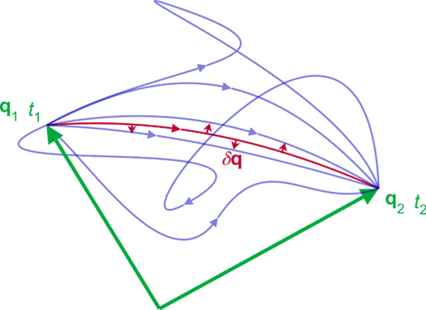
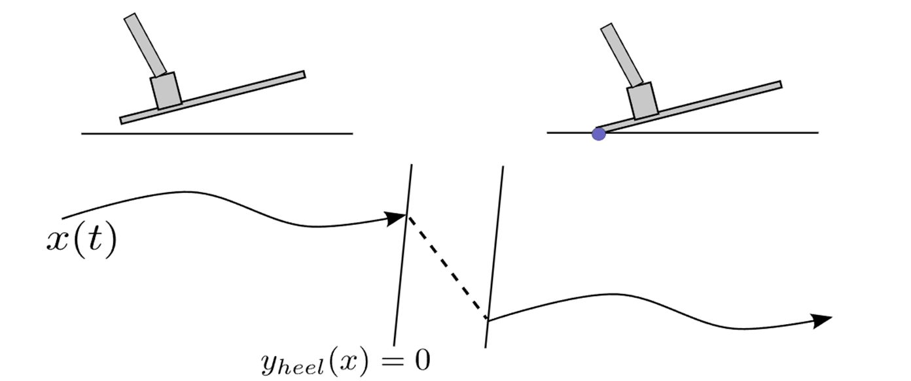
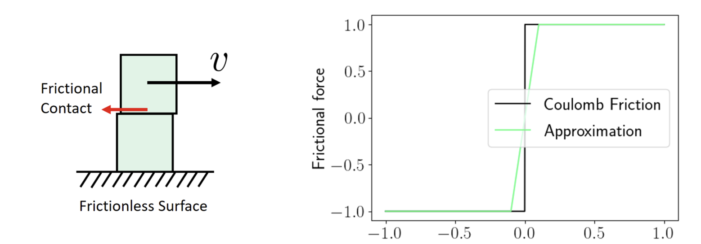
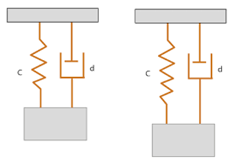
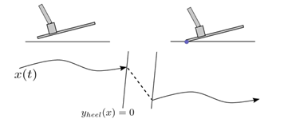
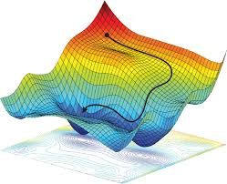
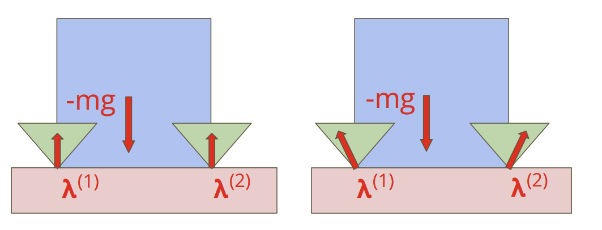
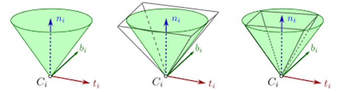

# 📚 Physics-based Simulator Tutorial      

Chaoyi Pan, Xiaofeng Guo, Nikhil Sobanbabu

<!-- 
Welcome
feel free to ask questions
 -->

---

# 💁 Agenda

<v-clicks>

## 1️⃣ Can simulate: rigid body (this week)

Chaoyi Pan: basic dynamics of rigid body simulation

## 2️⃣ Hard to simulate: soft body (this week + next week)

Xiaofeng Guo: advanced contact, soft body dynamics

## 3️⃣ Failed to simulate: unmodelled effects (next week)

Nikhil Sobanbabu: defects in sim, sim2real, real2sim

</v-clicks>

<!-- 
start from things that can be simulated well, i.e. rigid body dynamics.
 -->

---
layout: center
---

# 1️⃣ Rigid Body Dynamics

---

# Simulation sometimes can go weird…

What could go wrong with $\dot{x} = f(x, u, t)$?

<v-clicks>

### Why my simulator blow up?
### Why my robot sink into the floor?
### Why my block slip away from robot’s hand?
### Why the simulation is not deterministic?

</v-clicks>

<!-- 
simulation is mature, why are we still need to understand it?
because it do simplifications. 
some are necessary, while others leads to artifacts. 
if you encounter those 
 -->

---

# Today's roadmap

<v-clicks depth="2">

### Basics: 

- Coordinate: minimum/generalized coordinate, maximum/cartesian coordinate
- Discretization, integration: Explicit, RK, Implicit

### Multi-rigid-body System: 

- Least-action Principle and Euler Lagrange Equation
- Lagrangian Dynamics and Hamilton Dynamics
- Simulation with equality constraints / external force

### Contact

- Basic Contact Dynamics: smoothing method, hybrid method, time-stepping method
- Friction Modelling: maximum dissipation principle, LCP problem

### Case study: 

- X-Ray of Common Simulators: Mujoco, PhyX

</v-clicks>

<!-- 
today's tutorial will cover the techiniques used in most modern rigid body simulators. 
you will understand the most common simulators better. 
here is the roadmap:
 -->

---
layout: center
---

# Basics

## Coordinate, Discretization, Euler-Lagrange Equation

---

# Coordinate

<v-clicks>

### Minimum/Generalized Coordinate

Representation: in joint space $q, \dot{q}, \ddot{q}$

- ✅ Minimize the number of variables, used on most of the simulators
- ❌ Hard to compute constraints

### Maximum/Cartesian Coordinate

Representation: in task space $x, \dot{x}, \ddot{x}$

- ✅ Intuitive and easy to derive for simple system
- ❌ Leads to more constraints, extra computation

### Example: pendulum

$q = \theta, \dot{q} = \dot{\theta}, \ddot{q} = \ddot{\theta}$

$r = [x, y]^T, x^2 + y^2 = l^2$

</v-clicks>

<!-- 
First, 
Since simulator is used to predict the next state, we shall first figure out how the simulation represent the state. 
here are two common representation:
 -->

---
layout: two-cols
---

# Integration

$$
\dot{x} = f(x, u, t)
$$

<v-clicks>

## Explicit Integration

Euler: $x_{n+1} = x_n + \Delta t f(x_n, u_n, t_n)$
- 👍 Easy to implement, easy to calculate gradient 
- 👎 Diverge in energy

RK4: $x_{n+1} = x_n + \frac{\Delta t}{6} (k_1 + 2k_2 + 2k_3 + k_4)$
- 👍 More stable, more accurate
- 👎 Still diverge in energy, also $n\times$ evalutation time. 

</v-clicks>

::right::

<v-clicks>

## Implicit Integration
 
Solve $x_{n+1} - x_n - \Delta t f(\frac{x_{n+1}+x_n}{2}, u_n, t_n) = 0$

- 👍 Stable, conserve energy
- 👎 Hard to calculate gradient

</v-clicks>

<!-- 
Secondly, we always have to discretize the simulation to solve it numerically. 
Two methods: 

From upper to lower: more expensive, but more accurate. 

closing: now, with the basics, we can take a look at how to simulate a multi-rigid-body system in the next section. 
 -->

---
layout: center
---

# 2️⃣ Multi-rigid-body System

## How would an unconstrained system evolves over time?

<!-- 
The second part of will be about the simulation of contact-free system. 
With that, you know how it evolves in the air with external force. 
 -->

---

# What is Euler-Lagrange Equation

## Newton's law for general system

<v-clicks>

Newton's law: $M\ddot{q} - \nabla V = 0$

Euler-Lagrangian Equation: $\frac{d}{dt} \frac{\partial L}{\partial \dot{q}} - \frac{\partial L}{\partial q} = 0$

- $L = T - V$
- $T = \frac{1}{2} \dot{q}^T M(q) \dot{q}$: kinetic energy
- $V$: potential energy

</v-clicks>

<!-- 
Dynamics, first time in mind: Newton's second law. 
(click)
Newton's second law is the most intuive way to describe the dynamics of a system. 
But how to generalize it to the multi-link systems? are we going to calcuate the force/torque for each joint? 
 -->

---

# Why Euler-Lagrange Equation over Newton's Law

$$
\frac{d}{dt} \frac{\partial L}{\partial \dot{q}} - \frac{\partial L}{\partial q} = 0
$$

<v-clicks>

- Optimization formulation: convert simulation problem into a calculating L
- Coordinate invariant
- Clear physics interpretation: least action principle $\min_q \int L(q, \dot{q}, t) dt$

</v-clicks>

<!-- 
part from less variable number, E-L equation dominate the physics simulation for other reasons:

 -->

---

# Physics Interpretation of Euler-Lagrange Equation

## Least Action Principle, Hamilton's Principle

$$
\min_q \int L(q, \dot{q}, t) dt, \quad L = T - V  \\
\text{s.t.} \quad q(t_0) = q_0, q(t_1) = q_1
$$

<v-clicks>

- Explain how the system evolves from one state to another
- Choose a kinematics path such that: the average of kinetic energy and potential energy is minimized.
- Least action principle describe global behavior of the system, while Euler-Lagrange equation describe local behavior. They should be consistent. (can be proved. )

</v-clicks>

<!-- 
But you may ask, where does this E-L equation come from? turns out it's the result of Hamilton's principle. 
the physical intuition is that...
 -->

---

# Lagrangian Dynamics with External Force

"Lagrangian-D'Alembert" principle, aka "virtual work principle“: 

$$ {0|1|all}
\begin{aligned}
\partial_q \int L' dt & = \partial_q \int (L + F^T q) dt = 0 \\
 \frac{d}{dt} \frac{\partial L'}{\partial \dot{q}} - \frac{\partial L'}{\partial q} & = F
\end{aligned}
$$

<!-- 
Up to now, our system does not have any external force. 

Now, we have a full form of E-L equation. 
 -->

---

# Special Case: E-L Equation for multi-joint rigid body system

<v-clicks>

## Articulated rigid body:

$$
L = T - V = \frac{1}{2} \dot{q}^T M(q) \dot{q} - V(q)
$$

## Manipulator Dynamics

$$
M(q) \ddot{q} + C(q, \dot{q}) \dot{q} + G(q) = \tau
$$

</v-clicks>

<v-clicks>

- Used in most of the simulators, you can read those value from urdf parser. 
- $M(q)$: inertia matrix
- $C(q, \dot{q})$: Coriolis matrix
- $G(q)$: gravity term (sometimes integrated into $C$, called that "dynamic bias")
- $\tau$: joint torque
- Computationally expensive, $O(n^3)$ for $n$ joints, sometimes is sparse and can be reduced to $O(n)$. 

</v-clicks>

<!-- 
The above E-L equation is the most general form. 
For simple multi-link systems, the kinematic structure can be exploited to simplify the calculation. 
 -->

---

# Example

## Cart-pole

$$ {0|1|all}
\begin{aligned}
L & = \frac{1}{2} m_1 \dot{x}^2 + \frac{1}{2} m_2 \dot{x}^2 + \frac{1}{2} I_1 \dot{\theta}^2 + \frac{1}{2} I_2 \dot{\theta}^2 + m_2 g x \cos \theta \\
\frac{d}{dt} \frac{\partial L}{\partial \dot{q}} - \frac{\partial L}{\partial q} & = M(q) \ddot{q} + C(q, \dot{q}) \dot{q} + G(q) = \tau \\
M(q) & = \begin{bmatrix}
m_c + m_p & m_p l_p \cos \theta \\
m_p l_p \cos \theta &  m_p l_p^2
\end{bmatrix} \\
C(q, \dot{q}) & = \begin{bmatrix}
- m_p l_p \dot{\theta}^2 \sin \theta \\
0
\end{bmatrix} \\
G(q) & = \begin{bmatrix}
0 \\
- m_p g l_p \sin \theta
\end{bmatrix} 
\end{aligned}
$$

<!-- 
to see how it works, let's take a look at an example. 
 -->

---

# Constraints in E-L Equation

## Equality Constraint

<v-clicks>

$$
c(q, \dot{q}) = 0
$$

with equality constraints, the E-L eqn. is:

$$
\partial_q \int L' dt = \partial_q \int (L + \lambda^T c(q)) dt = 0 \\
\frac{d}{dt} \frac{\partial L'}{\partial \dot{q}} - \frac{\partial L'}{\partial q} - \lambda^T \frac{dc(q)}{dq} = 0
$$

- $\lambda$ is the Lagrange multiplier (**constraint force**) 
- $J(q) = \frac{dc(q)}{dq}$ is the Jacobian matrix of the constraint. 

</v-clicks>

<!-- 
one last thing we haven't talked about is equality constraints. 
When your system is closed loop or with tendon, you will have to constraint the relative position between some links. 
 -->

---

# Final Version of Manipulator Dynamics

## Manipulator Dynamics

<v-clicks>

$$
M(q) \ddot{q} + C(q, \dot{q}) \dot{q} + G(q)  = \tau + J(q)^T \lambda
$$

## KKT Condition

$$
\begin{bmatrix}
M & -J^T \\
J & 0
\end{bmatrix}
\begin{bmatrix}
\ddot{q} \\
\lambda
\end{bmatrix}
= \begin{bmatrix}
\tau - C(q, \dot{q}) - G(q) \\
-\frac{d}{dq} (J(q) \dot{q}) \dot{q}
\end{bmatrix}
$$

## Notes: 

</v-clicks>

<v-clicks>

- $J(q)$ is introduced since the constraint is applied in the maximum space, need to transform to the joint space.
- For system with equality constraints, the final form of manipulator dynamics can be solved explicitly without iteration. 

</v-clicks>

<!-- 
Now, we have a full form of manipulator dynamics. 
To solve that...
 -->

--- 

# 2️⃣ Multi-rigid-body System

## Takeaway

$$
M(q) \ddot{q} + C(q, \dot{q}) \dot{q} + G(q)  = \tau + J^T \lambda
$$

<v-clicks>

- **First principle**: Minimum action principle, everything can be derived from it.
- **Forward Dynamics is easy**: multi-rigid-body system + equality constraints = explicit solution. 
- More interesting things: 
  - Dual form: Hamiltonian Dynamics
  - Discretization: Legendre Transform, Variational Integrator

</v-clicks>

<!-- 
Now, if you want to learn one thing today, it should be this equation. 

also bear in mind the following point. 

if you want to learn more, please

 -->

---
layout: center
---

# 3️⃣ Contact

## The brightest jewel in the crown of simulation

<!-- 
Now, we will take a look at the most interesting part of dynamics, contact. 
 -->

---

# Why contact is such a headache?

## Impact = infinite acceleration/force

<!-- 
to give you a brief idea about why contact is so hard, let's first consider the most simple case: 

no longer contious, infinite acceleration/force. 
 -->

---

# Why contact is such a headache?

## Friction = non-continuous behavior

<!-- 
Impact is not the only thing that causes non-continuous behavior. 
Friction is another one. 
 -->

---

# Common workarounds

<v-clicks>

| Method                    | Description                                                                 | Pros                                                                                                                                       | Cons                                                                                                                                                      | Demonstration Image |
|---------------------------|-----------------------------------------------------------------------------|-------------------------------------------------------------------------------------------------------------------------------------------|----------------------------------------------------------------------------------------------------------------------------------------------------------|--------------------|
| Smooth Contact Model      | Uses a smooth contact force, spring-damper model. Used in Mujoco*.          | ✅ Easy to implement   ✅ Differentiable   ✅ Easy to control                       | ❌ Not accurate   ❌ No penetration   ❌ Energy dissipation not physical                                                                      |  |
| Hybrid/Event-Driven Method| Detects contact using a guard function with an extra jump map. Common in control. | ✅ Not stiff   ✅ Can use standard ODE solver                                                          | ❌ Scales poorly with number of contacts   ❌ Handles simultaneous contacts poorly   ❌ Not differentiable   ❌ Hard to design general simulators |  |

</v-clicks>

<!-- 
So how to handle contact? Here are 3 common workarounds: in total. 

today, we will focus on the last one which is the most common choice amoung modern simulators. 
 -->

---

# Common workarounds

<v-clicks>

| Method                    | Description                                                                 | Pros                                                                                                                                       | Cons                                                                                                                                                      | Demonstration Image |
|---------------------------|-----------------------------------------------------------------------------|-------------------------------------------------------------------------------------------------------------------------------------------|----------------------------------------------------------------------------------------------------------------------------------------------------------|--------------------|
| Time-stepping Methods     | Computes contact force at each time step to satisfy contact constraints. Used in Gazebo, Dart, Bullet. | ✅ Scales well with number of contacts   ✅ Handles simultaneous contacts well   ✅ Gives correct physics | ❌ Computationally expensive (solve optimization at each time step)   ❌ Not differentiable                                                          |  |

</v-clicks>

--- 

# Time-stepping Method

<v-clicks>

## Solving a Constrained Optimization Problem

$$
\min_q \int L(q, \dot{q}, t) dt \\
\text{s.t.} \quad q(t_0) = q_0, q(t_1) = q_1 \\
\quad c(q, \dot{q}, t) \geq 0
$$

- If $c$ only has impact and no friction, the problem is convex. 
- The problem could be non-convex due to the friction cone. 

</v-clicks>

<!-- 
generally speaking, the contact solver is a constrained optimization problem. 
it solve the least-action problem with additional constraints. (i.e. friction, contact constraints)

as for the problem convexity, it depends on the type of contact model you use. 

for most of the time, the contact is non-convex, which cause the problem hard to solve. 

now, let's take a closer look at the friction cone. 
 -->

---

# Handle Friction

<v-clicks>

## Maximum Dissipation Principle

The optimization problem solve for friction (dissipation means the energy loss in the system)

$$
\min_b \dot{T} \\
\text{s.t. } b \le \mu n \\
$$

</v-clicks>

<!-- 
friction could be underdetermined since multiple frictions could lead to the same joint force, especially for the system with multiple contacts. 
fortunately, we have a rule to solve it: maximum dissipation principle. 
 -->

---

# Handle Friction

## SOCP Formulation

$$
\min_b \dot{q}^T M b \\
\text{s.t. } b \le \mu n \\
$$

<v-clicks>

- When $\|b\| = 0$, the solver would fail. So we can use conic primal-dual interior point method to solve it. 
- A simple hack: use a smoothed 2-norm: $\|b\| = \sqrt{b^T b + \epsilon^2} - \epsilon$. 
- Impact, friction and q can be solved at the same time. 
- SOCP is NP-hard. 

</v-clicks>

---

# Further Simplify the Contact Problem

## LCP Formulation

linear approximation of friction cone. 

$$
\|b\|_1 \le \mu n
$$

By introducing a new variable $d$, the problem can be written as a LCP problem:

$$
b = \begin{bmatrix}
1 & 0 & -1 & 0 \\
0 & 1 & 0 & -1
\end{bmatrix} d\\
[1 \ 1 \ 1 \ 1] d \le \mu n \\
$$

---

# Further Simplify the Contact Problem

## LCP Formulation

<v-clicks>

- Problem is still non-convex, NP-hard. 
- But there are better solver can handle it. 
- Used in most of the simulators. 

</v-clicks>

<!-- 
But SOCP is still NP-hard and hard to solve. 
In most modern simulators, the friction is further approximated by the linear form. 
by introducing a new variable...
 -->

---

# 3️⃣ Contact

$$
\min_q \int L(q, \dot{q}, t) dt \\
\text{s.t.} \quad q(t_0) = q_0, q(t_1) = q_1 \\
\quad c(q, \dot{q}, t) \geq 0
$$

## Takeaway

<v-clicks depth=2>

- **Contact solver is a constrained optimization problem**: most of time it is non-convex. 
- **Contact always comes with approximation**: 
  - knowing what kind of approximation the solver is using can help you better understand the behavior of the system. 
  - But even the best solver, the contact is always approximated in the solving stage to make it tractable. 
  
</v-clicks>

> we haven't even mentioned the contact detection yet, which is another big topic. 

<!-- 
Now, to conclude this part, we added another components into our E-L equation: contact. 
 -->

---
layout: center
---

# 4️⃣ Case Study

## X-Ray of Common Simulators: Mujoco, PhysX

<!-- 
To finalize classic dynamics tutorial, let's take a look at two common simulators: Mujoco and PhysX. 
 -->

---

# MuJoCo

- Contact solver: smoothing method + extra constraints. (i.e. multiple string model)

$$
\begin{aligned}
(\dot{v}, \dot{\omega}) & = \arg \min_{(x, y)} \left\| x - M^{-1}(\tau - c) \right\|_M^2 + \| y - a_{\text{ref}} \|_R^{-1} \cdot \text{Huber}(\eta) \\
\text{subject to} \quad & J_E x_E - y_E = 0, \\
& J_F x_F - y_F = 0, \\
& J_C x_C - y_C \in K^*.
\end{aligned}
$$

<v-clicks>

- 👑 Open source, clean JAX implementation, easy to modify and blinding fast
- ✅ Differentiable, contact force always available
- ✅ Lots of options to regularize the contact solver, could be very realistic (tons of contact modes `condim`)
- ✅ Problem is always convex, easy to solve
- ❌ Hard to control, hard to manually tune the contact parameters
- ❌ Ecosystem: GPU pipeline rendering, generative model support, etc. 

</v-clicks>

<!-- 
First, let's take a look at Mujoco, which is the most common choice for RL tasks. 
Mujoco is a smoothing method we mentioned before, but with extra tweaks. 
It can handle multiple constraints system solve for the contact induced acceleration by considering every constraints. 

Here is the optimization problem it solve:
 -->

---

# PhysX

- Contact solver: time-stepping method, contact modelling with LCP
- Solver: Projected Gauss-Seidel (1st order, like coordinate descent)

<v-clicks>

- ✅ Open source (but issac series is not)
- ✅ Board learning community, first GPU-based simulator
- ✅ Comprehensive API and features
- ❌ Less modular
- ❌ The implementation is hard to read. Also, the wrapper is heavy. 
- ❌ Little bit hard to deploy, binding to distro and nvidia. 

</v-clicks>

<!-- 
Another simulator is PhysX, most people used for sim2real today since it is the first GPU-based simulator. 

Compared with mujoco, it use a more standard time-stepping method to solve the contact problem. 

As for friction, it is approximated by a linear form. 

As for the contact solver, it is a second-order cone programming (SOCP) problem. 

 -->

---

# Conclusion of Classic Dynamics

$$
\min_q \int L(q, \dot{q}, t) dt \\
\text{s.t.} \quad q(t_0) = q_0, q(t_1) = q_1 \\
\quad c(q, \dot{q}, t) \geq 0
$$

<v-clicks depth=2>

- **The problem it solves**: a non-convex optimization problem but can be convexified. 
- **The approximation they made**:
  - discretization
  - mass regularization
  - contact softening
  - friction linearization

</v-clicks>

<!-- 
To conclude this tutorial, I hope you can remember this equation, which every simulator shared in common. 

As for the end user, you should also know
discretization: when blow up, choose integrator
mass regularization: when system is too stiff
contact softening: choose right parameter
friction linearization: always take a look at the friction cone. 

Happy to take any questions!
 -->

